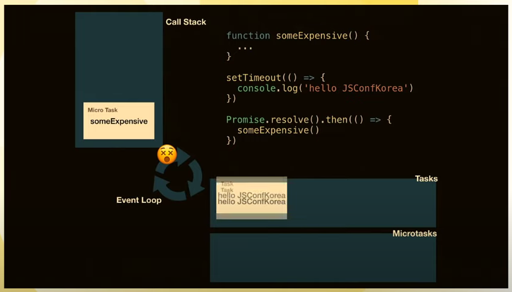
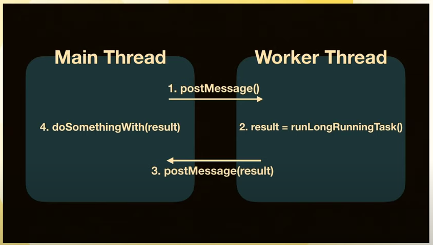

# Don't block the event loop! JavaScript Async for Effortless UX | JSConf Korea 2019(en sub)

이벤트루프에 관해서는 [링크](https://www.youtube.com/watch?v=8aGhZQkoFbQ) 이 영상이 최적이라고 생각한다. [영상과 함께 본 칼럼](https://baeharam.netlify.app/posts/javascript/JS-Task%EC%99%80-Microtask%EC%9D%98-%EB%8F%99%EC%9E%91%EB%B0%A9%EC%8B%9D)

그리고 지금 리뷰하려는 영상에서는 이벤트루프에 관한 또다른 정보가 하나 나온다. 바로 마이크로 태스크이다. 일반적인 경우 태스크와 마이크로 태스크 둘 다 합쳐서 그저 태스크로 생각해도 된다. 하지만 복잡한 로직이 들어가고 고비용 로직이 생길 경우 우리는 이 두가지를 나눠서 생각하는 것이 좋다.

- 콜백함수를 태스크 큐에 넣는 함수들
  - setTimeout, setInterval, setImmediate, requestAnimationFrame, I/O, UI렌더링
- 콜백함수를 마이크로태스크 큐에 넣는 함수들
  - process.nextTick, Promise, Object.observe, MutationObeserver

무엇이 우선일까? 마이크로태스크가 우선권을 가진다.

```javascript
console.log('콜 스택!');
setTimeout(() => console.log('태스크 큐!'), 0);
Promise.resolve().then(() => console.log('마이크로태스크 큐!'));
```

그래서 이따금 micro task에 들어간 로직이 매우 비싼 로직이면 태스크에 들어간 작은 비용의 로직이 실행되지 않는 상황을 볼 수도 있다. 즉, Blocking당한다는 것이다



그래서 해당 영상에서 생각하는 해결법은 두가지이다. 영상은 말한다 이것은 최선의 방식이 아닐 수 있지만 고안해볼만한 방안은 맞을 것이라고 해준다.

## Web Worker

스레드 프로그래밍과 같다. Message기반으로 이벤트를 처리한다.



```javascript
// main.js
// spawn a worker
const woker = new Worker('worker.js');

// send messages to a worker for request run long-running-task
worker.postMessage(message);

// handle a 'message' event from a worker
worker.onmessage = e => {
    doSomethingWith(e);
}

// worker.js
self.addEventListener('message', e => {
    const result = runLongRunningTask();
    
    postMessage(Result);
})
```

## Scheduling

무거운 테스크를 작은 테스크로 쪼개고 이걸 다른 테스크사이사이에 실행 시킬 수 있도록 하는 방법이다

`yield`를 이용해 쪼개주는 작업을 진행하면 된다.

