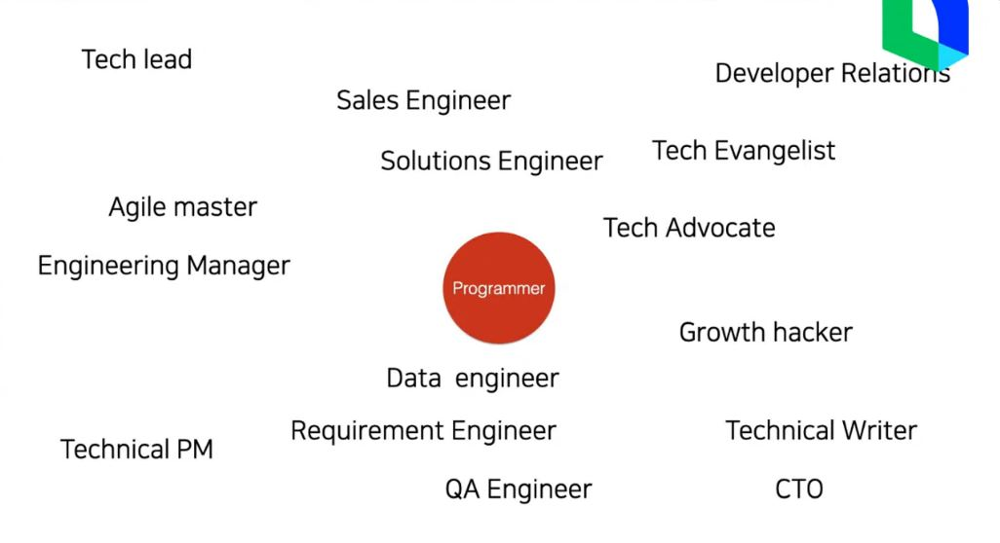

# LINE DEV Meetup #8 - 백발 될때까지 일하는 개발자가 되어보자

## 기업이 원하는 개발자

1. 코딩을 할 수 있다 
2. 최신 트렌드와 상황에 맞게 코딩을 할 수 있다 
3. 어떤 기술이 왜 쓰이는 지 이해하고 있다 
4. 문제를 찾아내서 기술로 해결할 수 있다

아래로 내려올 수록 시니어에 가깝다. 옛날에는 40을 넘으면 은퇴해야할 직업이었지만 최근에는 시니어 경력자가 많이 필요해진 직업분야이다!

## 개발자 이후의 커리어 패스

## 개발자로 자신을 계속 성장시키기

1. 코딩 & 소프트웨어 전문가되기

   계속 질문을 가지자! 이건 왜 이렇게 동작하는 것일까? 더 빠르게, 더 효율적으로 어떻게? 등등

2. 나만의 지식 파이프라인 (읽고 쓰기)

   read tech articles

   좋은 동영상 강의 들도 많다!

   블로그를 쓰자!

   TIL

3. 개인 프로젝트를 한다 (Github 가꾸기)

   오픈소스 기여

4. 개발자들과 네트워킹

   커뮤니티 활동

