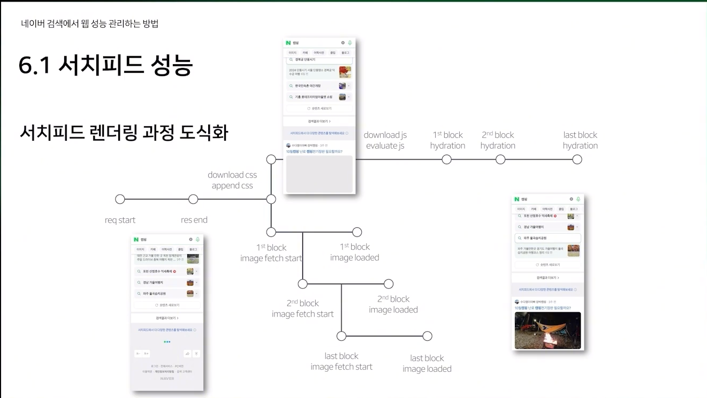

# 네이버 검색에서 웹 성능 관리하는 방법: web-vitals 수집부터 개선까지

[영상 링크](https://tv.naver.com/v/67445696)

> 1. 웹 성능 측정 방식
> 2. 네이버 검색 웹 성능 가이드라인
> 3. 성능 지표 수집
> 4. 성능 모니터링
> 5. 성능 분석 및 개선 사례
> 6. LCP로 측정하기 어려운 성능

## 0. Intro

- 웹 성능이란
  - 이 팀에서 생각하는 것은
    - 얼마나 빠르게 보이는가
    - 얼마나 빠르게 반응하는가
  - 왜 중요하죠?
    - 비즈니스 성공에 영향
    - 안정적인 서비스 운영

## 1. 웹 성능 측정 방식

1. 과거 성능 측정 방식
   - load
     - load 이벤트란
       - 스타일시트, 스크립트, 이미지를 포함한 페이지의 모든 리소스의 로드 완료 시점
     - load 이벤트 기준 측정 방식의 문제점
       - 사용자 체감 성능과 차이
       - 랜더링이 완료되었을 때가 아니기 때문에 유저는 랜더링되었을 때 로드가 끝났다 생각
       - load 뒤에 랜더링이 완료되는 케이스가 있다
2. 새로운 측정 방식
   - web vitals
     - LCP, INP, CLS는 Core Web vital로 다루고 있다
     - 요 영상에서는 LCP가 중심이다
   - LCP
     - 화면에서 가장 큰 이미지, 텍스트 블록, 동영상의 렌더링 시간
       - 화면을 렌더링 하면서 LCP 영역을 계산
       - 사용자 인터렉션 발생시 측정 종료
   - LCP score
     - 쾌적한 사용자 환경을 제공하기 위한 기준
       - 웹페이지에 접근한 100명중 75명 이상의 LCP가 2.5초 이하가 되는 것을 권장

## 2. 네이버 검색 웹 성능 가이드 라인

1. 대표 지표
   - LCP를 대표 지표로 선정
     - 이유?
       - 수치화 가능하고 비교할 수 있으며 임계값을 설정할 수 있음
       - 서버 응답 시간과 클라이언트 렌더링 시간에 모두 영향을 받음
       - 지표 변화에 따른 문제점 분석이 가능함
2. 황금 지표
   - 네이버 검색 웹 성능 가이드 라인
     - 전체 검색 사용자의 95th LCP가 2.5초 이하
     - 검색 영역 단위는 75th LCP가 2.5초 이하

## 3. 성능 지표 수집

1. 수집 방식
   - 언제, 어떻게 수집하는가
     - 구글의 web-vitals library를 사용
     - 크로뮴과 파이어 폭스 데이터가 수집됨
     - 성능 지표가 측정될 때 마다 전송 vs 한번에 전송
       - visibility change event 발생 시점에 한 번 전송
       - 어떤게 정확한 LCP인지 파악이 안되고 네트워크 데이터를 이용한다든지 이슈때문에 한번에 보내는 것으로 결정
       - 문제는 중간만 렌더링 되었는데 액션이 날 시에 의도된 web vitals가 수집이 안됨
     - SendBeacon을 이용해 전송
       - 유실률 최소화
2. 수집 데이터 노이즈 제거
   - 수집 데이터 필터링
     - navigation type에 따른 필터링
       - bfcache 동작 시 성능 지표가 매우 빠름
     - 브라우저 상태에 따른 필터링
       - 활성화 상태가 아닌 경우 성능이 느림

## 4. 성능 모니터링

1. 성능 리포트
   - 성능 변화를 감지하자
     - 매주, 매월 리포트 작성
     - 리소스 절감을 위한 자동화
     - 리포트 발행 시점에만 성능 변화 감지 가능
2. 성능 대시보드
   - 성능 변화를 빠르게 감지하자
     - 실시간 데이터를 정제하여 분 단위 데이터 확인
     - 신규 데이터 추가의 병목을 제거
       - 데이터 추출 > DB 테이블 생성 > BE API 개발 > FE 차트 개발
       - 데이터 추출 > Object Storage 저장 > FE 차트 개발
3. 성능 알람
   - 성능 변화를 빠르게 자동으로 감지하자
     - 실시간 데이터 기반으로 이슈 발생 여부 판단
     - 성능 이슈 발생 시 주로 확인하는 데이터 추출 자동화
       - 서버 응답 시간, 사용자 쿼리 랭킹 등
     - 오탐률 개선

## 5. 성능 분석 및 개선 사례

1. 성능 분석 사례
   - 사용자 패턴에 의한 성능 변화
     - 일시적으로 검색 트래픽이 급증하는 경우
       - 재난 문자 발송 > 검색 트래픽 급증 > LCP 개선
       - 비교적 LCP가 좋은 영역이 많이 노출되었기 때문
2. 성능 개선 사례
   - 네이버 검색의 특수한 상황
     - 검색 결과가 매우 다양하고 LCP 영역이 동일하지 않음
     - 개선 포인트 찾기
     - 전체 검색 결과 개선 vs ~~특정 검색 결과 개선~~
       - 네이버 검색 렌더링 도식화
       - load 이벤트 발생 시점으로부터 150ms 뒤에 JS를 로드하는 케이스 발견
         - 과거 성능 지표 개선을 위한 방법 중 한가지
         - 그리고 JS 이후에 추가 image를 로드 하니 LCP에 악영향
         - load 이벤트가 늦어지는 케이스에서도 문제가 발생
       - js 로드 시점을 dcl로 변경
         - ABT로 테스트 해보며 이슈가 없음을 파악

## 6. LCP로 측정하기 어려운 성능

1. 서치피드 성능
   - LCP의 한계점
     - 화면 밖 성능 측정 불가
       - 무한 스크롤 성능 측정 불가
   - 새로운 형태의 검색 '서치피드'
     - 무한 스크롤 형태의 검색
       - 기존 방식으로 성능 측정 불가
       - RUM 성능을 측정할 수 는 없을까
   - 서치피드 노출 과정
     - 로딩 영역 렌더링
     - DOM 렌더링
     - 이미지 렌더링
   - 서치피드 렌더링 과정 도식화
     - 
   - FUPP
     - 피드 사용자 체감 성능 지표
   - 이미지 로드 타이밍
     - 이미지가 어느 시점에 사용자에게 보여졌는가
   - 최적화된 서치피드 호출 시점
     - 사용성과 서버 부하 사이의 그 어딘가
       - 너무 빠르게 호출하면 사용성은 좋아지지만 서버 부하가 높아짐
       - 너무 느리게 호출하면 서버 부하는 낮아지지만 사용성은 안 좋아짐
     - ABT 설계
       - control: 화면 하단으로부터 1000px
       - treatment: 화면 하단으로부터 200~1600px
       - 너무 느리게 호출하는 경우 소비지표 감소
         - 피드 사용성 악화
       - 너무 빠르게 호출하는 경우 소비지표 감소
         - 서치피드 소피를 원하지 않는 사용자까지 도달
