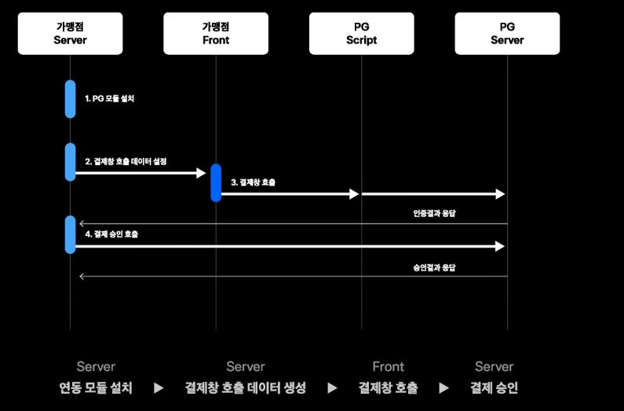
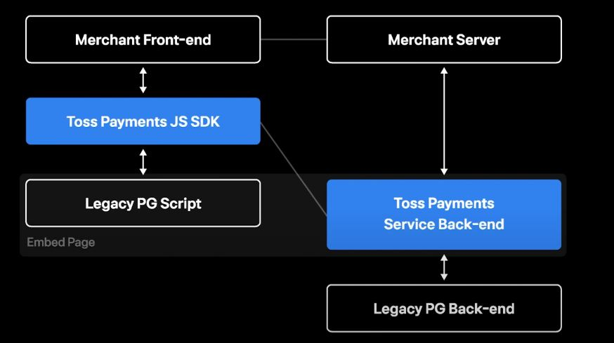
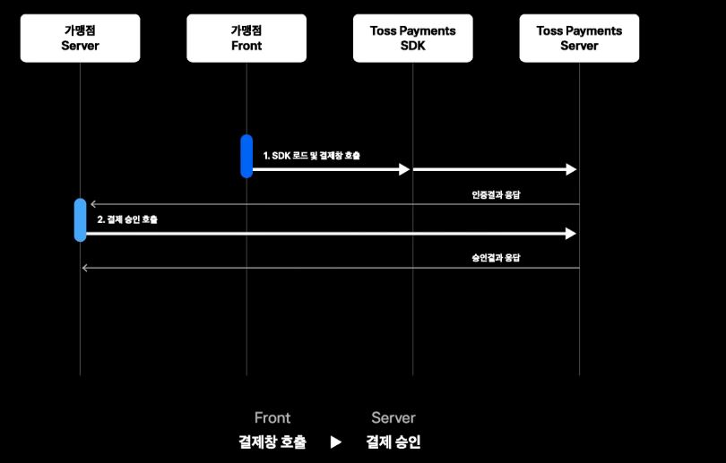
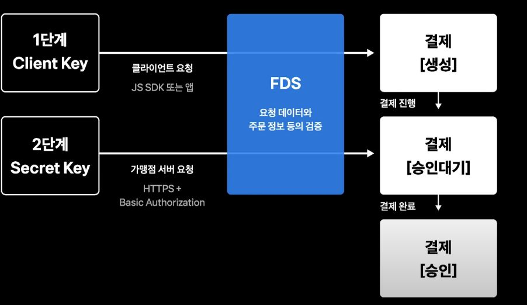

# 결제 시스템의 SDK와 API 설계 사례

[영상 링크](https://www.youtube.com/watch?v=E4_0WWqmF3M)

> 1. PG Experience
> 2. Payments API
> 3. JavaScript SDK

## 1. PG Experience

- 일반적 온라인 결제 연동 개발
  - 방식: 구매자 => 쇼핑몰 => 연동 개발 필요 => PG => 카드사
  - 
  - 단점
    - 가맹점 서버에 의존이 생기는 모듈 설치
      - 최신언어에 대응하지 않는 경우도 많았음
    - 이해하기 힘든 요청과 파라미터
- 신규 SDK 및 API 레이어를 만들어서 위 상황을 해결하고자 하였음
  - 
  - 
  - 개발 기간이 짧아짐

## 2. Payments API

- 3대 원칙
  1. 고객(가맹점) 편의가 우선
  2. 쉽고 간결한 디자인
  3. 웹 표준 사용

1. 가맹점 편의가 우선

   RESTful 디자인 원칙과 가맹점 편의의 균형

   순수한 CRUD의 경우 Create <=> POST, Read <=> GET, Update <=> PUT, Delete <=> DELETE

   문제가 있다. http클라이언트 모듈이 delete, put미지원하거나 인프라, 방화벽 문제등 delete,put이용이 불가능한 경우가 자주 있었다. 그래서 POST와 GET만 사용하기로 하였음. 그리고 가이드를 정의했다

   GET은 리소스에 변화가 없을때 POST는 변화가 있을때 동사형을 뒤에 붙이도록 처리 하였음

   `/payments/{key}/cancel`과 같이 시행하려고 함

2. 쉽고 간결한 디자인

   버전/리소스/ID/행동

   이러한 디자인을 주목

   JSON으로 응답을 보여주고 계층형태를 최대한 이용함

   ```json
   {
       'key': 'key',
       'card': {
           'company': '삼성',
           'number': 'number'
       },
       'receipt': {
           'number': 'number',
           'type': 'type'
       }
   }
   ```

   또한 최대한 같은 객체를 이용해서 보내줄려고 노력함

   또한 한국어를 최대한 이용하기로 했지만 영어를 쓰는 곳도 있었음 `Accept-lengauage`를 이용하여 특정 언어에 맞춰서 언어를 맞춰주었음

   오류핸들링에 따라 가맹점이 반응이 달라서 바디로 표현을 해주는 방안을 생각했다

3. 웹 표준만으로 충분하다

   TLS 1.2이상과 웹표준을 열심히 해야한다.

   

## 3. JavaScrpts SDK

결제창 열기가 제일 먼저일 것이다 => `결제창 열기 == 온보딩 경험` 

온보딩 경험이 너무 복잡하면 개발자는 쉽게 이탈한다 ===> 위조건과 합치면 아래와 같은 결과가 나온다

`결제창 열기가 힘들면 개발자는 쉽게 이탈한다`

그리고 이용하는 쪽이 이걸 제어하려면 힘들기 때문에 javascript sdk를 주괴로 결정했다. 그래서 tosspayments 스크립트를 제공하기로 결정. 더 고민 해본 것들도 많다

- 사용하기 쉬운 API
  - 결제 수단이 다른 기능들이 api마다 다 있다면 이용이 어려울 것이다
  - 결제 수잔을 넘기는 api를 제작한다면 radio버튼으로 해당 값만 넘길 수 있도록 제어할 수가 있다.
    - if/else문의 사용이 덜 이용될 것이다.
- npm 모듈 지원
  - npm설치가 가능하도록 유저가 이용하기 편하도록 만들었음
  - npm패키지로 설치해보자
- TypeScript 지원

[토스 가이드](https://docs.tosspayments.com/)

