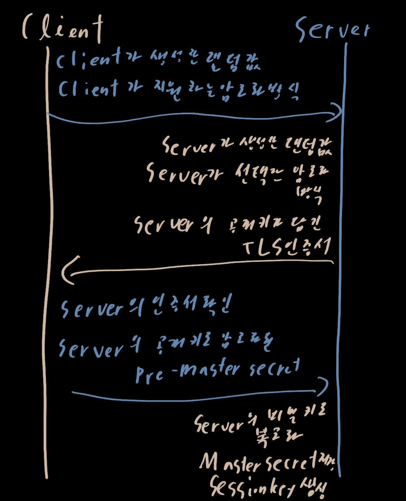
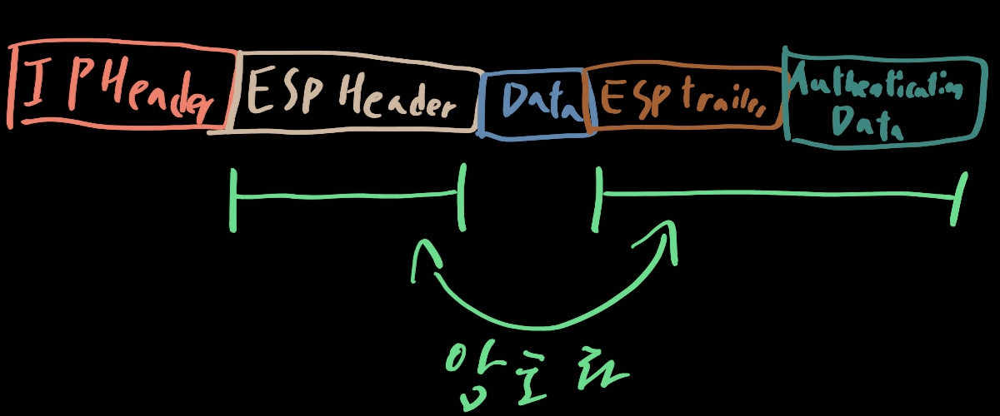

# 네트워크 보안

[유튜브 링크](https://www.youtube.com/watch?v=ww8Rz-Se3os)

- 네트워크 보안이 필요한 이유

  - tcp/ip 프로토콜이 주인데 이것은 1980년대 나왔다
  - 그리고 역사가 길어짐에 따라 비신뢰적 사용자가 생겨 보안이 필요해짐

- 보안의 3요소

  - 기밀성: 인가되지 않은 사용자가 정보의 내용을 알 수 없도록 하는 것
  - 무결성: 정보가 인가된 사용자 의해서만 변경 가능한 것
  - 가용성: 정보에 대한 사용이 확실하게 보장되는 것

- 네트워크 공격 케이스

  1. 스니핑

     네트워크 패킷을 도청하는 공격

  2. 스푸핑

     네트워크 패킷을 변조하는 공격

  3. Dos

     공격 대상의 자원을 소비시켜 서비스를 마비시키는 공격

- 보안 프로토콜들

  - TLS

    - 전송 계층의 보안 프로토콜
    - 대칭키를 통한 암호화 제공
    - 메시지 인증 코드를 통한 데이터 인증 제공
    - 연결 과정에서 서버 인증 제공
    - 
    - 이 방식을 이용하는 서비스는 뒤에 s가 붙음) https가 대표적

  - IPsec

    - 인터넷 계층의 보안 프로토콜

    - TCP만 보호하는 TLS와는 달리 TCP와 UDP까지 보호

    - 대표적으로 AH와 ESP 프로토콜

      - AH (Authentication Header)

        무결성 제공

        

      - ESP

        

        무결성 + 기밀성 제공

  - 방화벽

    - 트래픽 차단 및 필터링
    - 접근 제어
    - 외부 불법 침입 차단
    - 내부 정보 유출 방지
    - 내/외부 네트워크 상호간의 영향을 차단

  - IDS

    - 네트워크 실시간 모니터링
    - 침입 패턴 데이터베이스와 지능형 엔진을 사용
    - 불법적인 침입을 탐지

  - IPS

    - IDS기능 + 차단
    - 침입 탐지 후 자동으로 대응 및 차단
    - 방화벽과 함께 사용하면 효율적

  - WAN

    - Wide Area Network
    - 비용이 상당함

  - VPN

    - 가상 사설 망
    - 거점 랜선 끼리의 라우터를 터널로 연결
    - 그리고 라우터 사이의 터널로만 대화할 수 있도록 한다

  - 망 분리

    - 내부망과 외부망이 동시접속이 가능하면 내부 데이터가 외부로 유출 또는 공격을 받을 수가 있다
    - 물리적 망분리
      - 내부망 외부망을 아예 따로 구별하도록 하는 것
      - 보안상 가장 안전
    - 논리적 망분리
      - PC기반 가상화
        - 가상 영역을 통해 OS마다 망을 분리
      - 서버 기반 가상화
        - 사용자에게 할당하는 방식