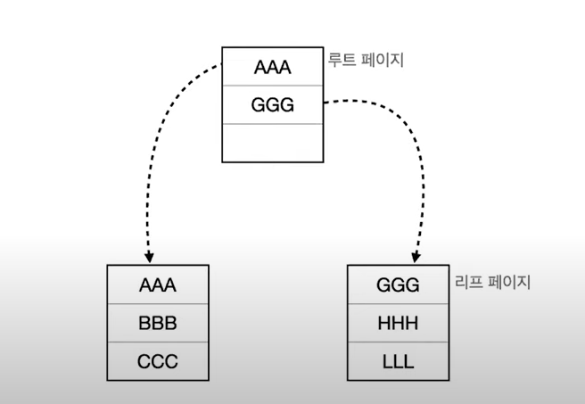
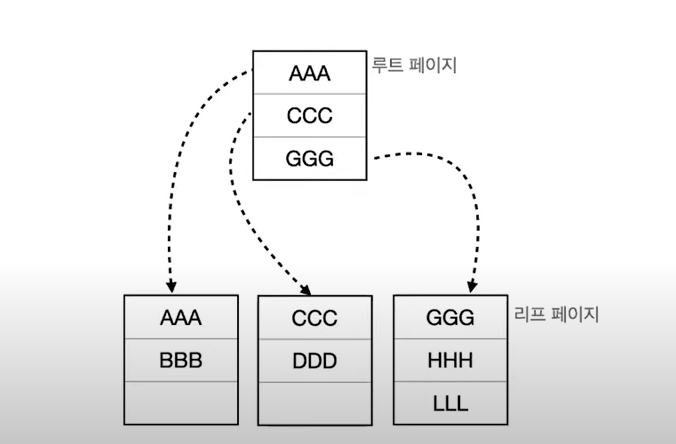
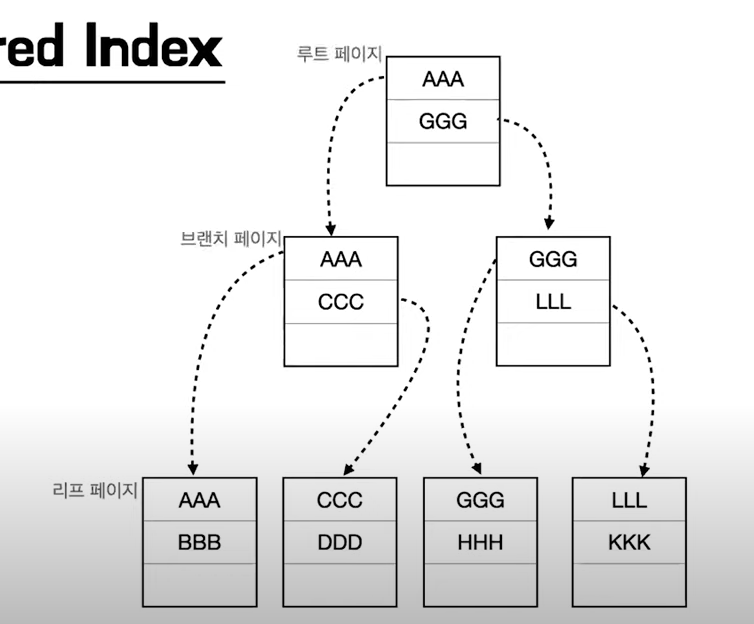
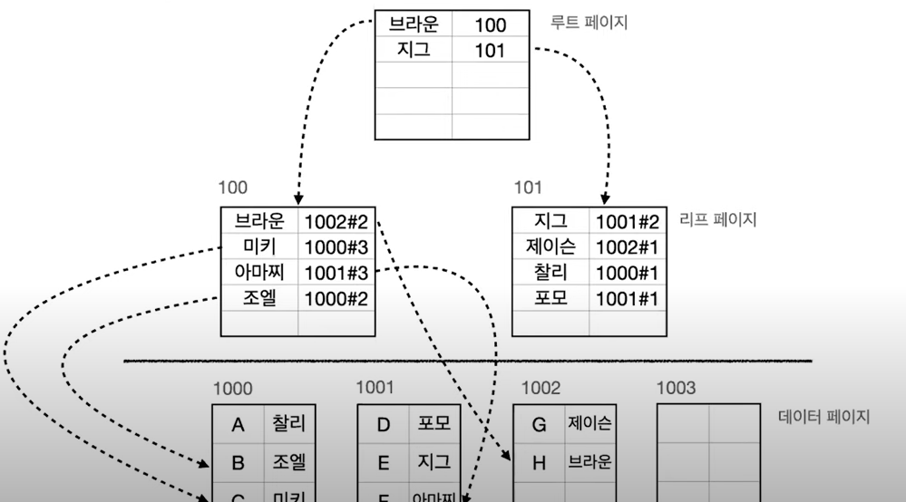
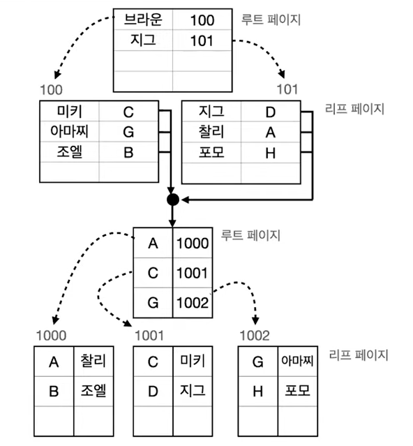

# 인덱싱

[영상 링크](https://www.youtube.com/watch?v=P5SZaTQnVCA)

> 1. Index란?
> 2. Index의 사용 목적
> 3. Index의 작성 / 삭제
> 4. Index 검색에 사용하는 알고리즘
> 5. Clustered Index vs Non-Clustered Index
> 6. 카디널리티
> 7. Index 사용시 주의사항

## 1. Index란?

찾기 쉽게 도와주는 역할을 한다

## 2. Index의 사용 목적

데이터 베이스의 Index 사용 목적 - 대용량 데이터에서 원하는 데이터를 빠르게 조회하기 위해

하지만 반대로 insert, update, delete 시 성능이 조금 떨어지게 된다.

## 3. Index의 작성 / 삭제

Index도 하나의 데이터베이스 객체, oracle DB2등에서는 스키마 객체, MySQL, SQL Server 등에서는 테이블로 저장된다. 즉, Index도 저장할 곳이 필요하고 보통 일반적으로 데이터베이스 전체의 십퍼센트정도 차지하게 된다고 함

## 4. Index 검색에 사용하는 알고리즘

- Full Table Scan
  - 데이터가 1억건이 있다면 1억개를 다 스캔해보는 방식
- B-Tree
  - 인덱스에서 가장 흔하게 사용하는 알고리즘
  - 이진 트리는 조금 속도가 느려질 수 있다
  - 그것을 대신해서 만든 것이 B-Tree이다

## Clustered Index vs Non-Clustered Index

- Cluster - 무리를 이룬 인덱스 (인덱스 안에 데이터를 포함)

  - 특징

    - 테이블 당 1개만 존재
    - PK 제약조건으로 컬럼을 생성하면 자동생성
    - 인덱스에 데이터 페이지가 함께 존재
    - 리프 페이지 == 데이터 페이지
    - 데이터가 정렬된 상태

  - 데이터 삽입의 상황

    - 

      

      이처럼 페이지를 삽입할때 리프페이지를 생성해서 복사해오는 작업을 할 때도 있다

      극악의 상황은 루트 페이지의 루트페이지를 만드는 과정도 종종 일어난다. 저기서 LLL뒤에 넣는 걸 작업하면 아래처럼 더 일어난다

      

- Non-Clustered - 비 군집 인덱스 (인덱스 안에 데이터를 포함하지 않음)

  - 특징
    - Secondary Index (보조 인덱스) 라고도 한다
    - 테이블에 여러개가 존재
    - Unique 제약조건으로 컬럼을 생성하면 자동으로 생성
    - 인덱스와 데이터 페이지가 따로 존재
    - 리프 페이지에서 데이터가 있는 곳의 주소를 가진다
    - 데이터 페이지에 데이터가 정렬되지 않아도 된다
    - Clustered와 비교해 조회는 조금 느리지만 cud에서는 빠르다
  - 

- 둘의 합체

  - 

## 6. 카디널리티

어떤 컬럼에 인덱스를 생성해야 하는가? => 중복된 수치가 낮은것 즉, 카디널리티는 이 중복된 수치가 역으로 정산되어 있는 것

## 7. 인덱스 사용 시 주의 사항

잘 사용해야한다는 문제가 당연히도 있따. 컬럼에 인덱스를 생성해도 select문의 where 절에서 사용하지 않는다면 큰 효율이 없다는 것이다.

