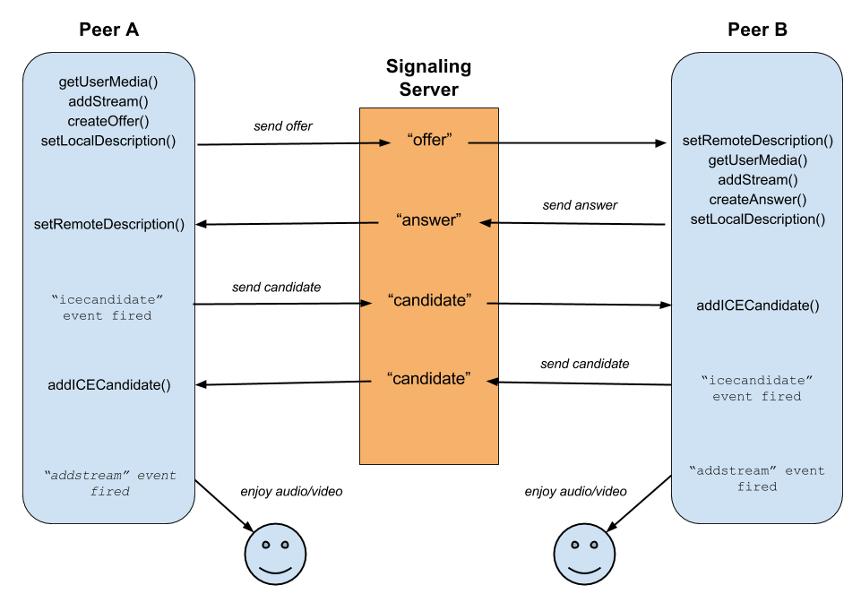

# webrtc

## webRtc 이론

[참고 mdn 문서](https://developer.mozilla.org/ko/docs/Web/API/WebRTC_API)

> p2p시스템을 웹으로 구축할 수 있도록 도와줌

- 서버가 필요하기는 하다
  - signaling을 하기 위한 서버가 필요
    - 상대방과 나의 연결점을 찾는 것을 도와줌
  - signaling이 끝나면 p2p로 연결이 된다
- 간단하게는 아래와 같은 프로세스인 것이다
  1. 1번 유저가 서버와 signaling으로 연결가능하게 올려둠
  2. 2번 유저가 1번 유저와 연결하고 싶다고 signaling을 요청
  3. 2번 유저는 서버에게 인증을 받고 1번 유저와 연결할 수 있도록 도움
  4. 1,2번 유저는 서로 연결된다
  5. profit
- signaling을 순서대로 하면 아래와 같다
  - 

### connection 만들기

> Peer A와 B를 나눴지만 사실 같은 코드 안에 있어야함을 알자
> 어차피 프론트는 나눠 받는게 아니다 (되나?)

```javascript
// Peer A의 일
// socket
socket.on("welcome", async () => {
  const offer = await myPeerConnection.createOffer();
  myPeerConnection.setLocalDescription(offer);
  socket.emit("offer", offer, roomName);
});

socket.on("answer", async (answer) => {
  myPeerConnection.setRemoteDescription(answer);
});

// rtc
function makeConnection() {
  myPeerConnection = new RTCPeerConnection();
  // STUN 서버가 없으면 필요하다고 뜰 것이다.
  myPeerConnection.addEventListener("icecandidate", handleIce);
  myPeerConnection.addEventListener("addstream", handleAddStream);
  myStream
    .getTracks()
    .forEach((track) => myPeerConnection.addTrack(track, myStream));
}

function handleIce(data) {
  socket.emit("icecandidate", date.dandidate, roomName);
}

function handleAddStream(data) {
  // 상대방에 대한 정보가 들어온다
  // 데이터로 하고 싶은 것을 진행하면 된다
}
```

> server가 할 일
>
> offer 신호를 듣고 offer과 방정보를 받는다 =>
> 해당 방에 offer 이벤트를 전달시키면서 offer 데이터를 전달
>
> answer 신호를 듣고 answer과 방정보를 받는다 =>
> 해당 방에 answer 이벤트를 전달시키며 answer 데이터를 전달
>
> icecandidate 신호를 듣고 candidate와 방정보를 받는다 =>
> 해당 방에 icecandidate 이벤트를 전달시키며 candidate 데이터를 전달

```javascript
// Peer B의 일
socket.on("offer", async (offer) => {
  // 도착할 때 myPeerConnection이 아직 없을 수도 있다.
  // 이것을 방지하기 위해서는 방참가를 서버에 알리기 전에 peerConnection을 먼저 만드는 방식을 해야한다. (코드마다 다를 것이니 인지하고 있자)
  myPeerConnection.setRemoteDescription(offer);
  const answer = myPeerConnection.createAnswer();
  myPeerConnection.setLocalDescription(answer);
  socket.emit("answer", answer, rooName);
});

socket.on("icecandidate", (ice) => {
  myPeerConnection.addIceCandidate(ice);
});
```

## STUN 서버

> 어떤 것을 request받으면 누군지 특정하는 서버
>
> 그리고 특정지어서 피어 커넥션을 만든다.
>
> 구글에서 제공하는 스턴서버를 사용해도 된다.
>
> 하지만 직접 공부해서 만들어볼 생각을 하자

```javascript
function makeConnection() {
  myPeerConnection = new RTCPeerConnection({
    iceServers: [
      {urls: [
        "stun:stun.l.google.com:19302",
        "stun:stun1.l.google.com:19302".
        "stun:stun2.l.google.com:19302".
        "stun:stun2.l.google.com:19302".
        "stun:stun3.l.google.com:19302"
      ]}
    ]
  })
}
```

## user video and other actions

[참고 mdn 문서](https://developer.mozilla.org/ko/docs/Web/API/MediaDevices/getUserMedia)

```javascript
const myFace = document.getElementById("myFace");
const muteBtn = document.getElementById("mute");
const cameraBtn = document.getElementById("camera");

let myStream;
let muted = false;
let cameraOff = false;

async function getMedia() {
  try {
    myStream = await navigator.mediaDevices.getUserMedia({
      audio: true,
      video: true,
    });
    myFace.srcObject = myStream;
  } catch (e) {
    console.log(e);
  }
}

function handleMuteClick() {
  myStream
    .getAudioTracks()
    .forEach((track) => (track.enabled = !track.enabled));
  if (!muted) {
    muteBtn.innerText = "Unmute";
  } else {
    muteBtn.innerText = "mute";
  }
  muted = !muted;
}
function handleCameraClick() {
  myStream
    .getVideoTracks()
    .forEach((track) => (track.enabled = !track.enabled));
  if (!cameraOff) {
    cameraBtn.innerText = "camera off";
  } else {
    cameraBtn.innerText = "camera on";
  }
  cameraOff = !cameraOff;
}

muteBtn.addEventListener("click", handleMuteClick);
cameraBtn.addEventListener("click", handleCameraClick);
```

- 미디어 도구 바꾸는 법
  - 유저가 선택
  - 선택한 미디어의 value를 바꿔주면 된다
  - 그다음 미디어 얻는 함수를 재 실행 (위 예시의 경우에는 getMedia)
  - 그래서 위 순서를 한번에 시키는 방법은 getMedia에 deviceId를 인자로 받는 함수로 만들고 정해주면 될 듯 하다
  - 아마 아래와 같은 흐름으로 진행될 듯 하다. (에러나면 알아서 찾아서 해보자)
  - ```javascript
    let myStream;
    async function getMedia(deviceId) {
      const initialConstraints = {
        audio: true,
        video: { facingMode: "user" },
      };
      const cameraConstraints = {
        audio: true,
        video: { deviceId: { exact: deviceId } },
      };
      try {
        myStream = await navigator.mediaDevices.getUserMedia(deviceId ? cameraConstraints : initialConstrains);
        MyFace.srcObjects = myStream;
      }
    }
    ```
  - 값이 바뀌면 peerConnection에 연결된 기기의 ID를 바꾼다 [참고문서](https://developer.mozilla.org/en-US/docs/Web/API/RTCRtpSender)
  - ```javascript
    async function handleCameraChange() {
      await getMedia(camerasSelect.value);
      if (myPeerConnection) {
        const videoTrack = myStream.getVideoTracks()[0];
        const videoSender = myPeerConnection
          .getSenders()
          .find((sender) => sender.track.kind === "video");
        videoSender.replaceTrack(videoTrack);
      }
    }
    ```
