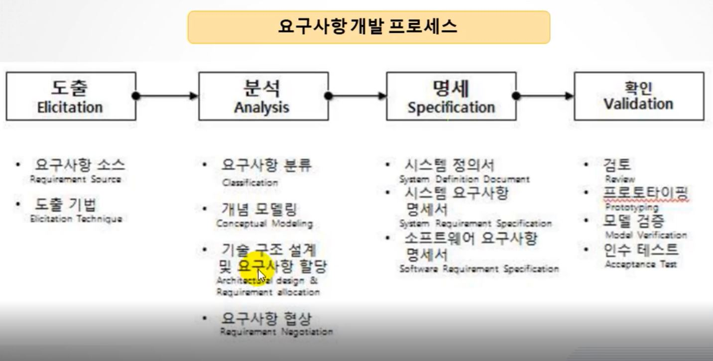

요구사항 확인

> ## 현행시스템 분석하기
>
> 1. 현행 시스템 파악
> 2. 개발 기술 환경 정의
>
> ## 요구사항 확인하기
>
> 1. 요구사항 정의
> 2. 요구사항의 시스템화 타당성 분석
>
> ##

## 현행 시스템 분석하기

1. 현행 시스템 파악

   - 현행 시스템 파악의 개요

     - 현행 시스템 파악의 정의

       현행 시스템이 **어떤 <u>하위</u> 시스템으로 구성**되어 있는지, **제공하는 <u>기능</u>**이 무엇인지, 다른 시스템들과 **어떤 <u>정보</u>를 주고받는지**, **어떤 <u>기술요소</u>를 사용하고 있는지**, 사용하고 있는 **<u>소프트웨어</u> 및 <u>하드웨어</u>는 무엇**인지, **<u>네트워크</u>는 어떻게 구성**되어 있는지 등을 파악하는 활동

     - 현행 시스템 파악의 목적

       이를 통하여 향후 개발하고자 하는 **<u>시스템의 개발범위 및 이행방향성 설정</u>에** 도움을 주는 것이 목적이다.

     - 파악 절차

       1. 1단계: 구성, 기능, 인터페이스 현황 파악
       2. 2단계: 아키텍처 및 소프트웨어 구성 현황을 파악
       3. 3단계: 하드웨어 및 네트워크 구성 현황을 파악

       구성,기능,인터페이스 -> 아키텍처, 소프트웨어 구성 -> 하드웨어, 네트워크 구성

   - 현행 시스템 구성 현황

     - 현행 시스템 구성 현황의 정의
       
       - 현행 시스템 구성 현황은 **조직의 주요 업무를 처리하는 <u>기간 업무</u>**와 **이를 지원하는 <u>지원 업무</u>**로 구분하여 기술한 것이다
     - 현행 시스템 구성 현황 작성 시 <u>고려 사항</u>
       
       - 각 업무에 속하는 단위 업무 정보시스템들의 <u>명칭</u>, <u>주요 기능들</u>을 **명시**함으로써 조직 내 존재하는 **<u>모든 정보 시스템의 현황을 파악</u>**하도록 한다
     - 기능 현황
       - 기능 현황의 정의
       
         **단위 업무 시스템**이 현재 제공하고 있는 **<u>기능</u>을 기술**한 것이다
       
       - 기능 현황 작성 시 고려 사항
       
         단위 업무 시스템에서 제공하는 기능들을 **주요 기능**과 **하부 기능**으로 구분하여 **<u>계층형</u>으로 표시**한다
     
   - 인터페이스 현황
   
     - 인터페이스 현황의 정의
   
       단위 업무 시스템이 다른 단위 업무 시스템과 주고받는 **<u>데이터의 종류</u>, <u>데이터 형식</u>, <u>프로토콜</u>, <u>연계유형</u>, <u>주기</u> 등을 명시**한 것이다
   
     - 인터페이스 현황 작성 시 **고려 사항**
   
       중요한 고려 사항으로는 **어떤 형식(format)**으로 데이터를 주고받는지 (예를 들어 XML, 고정포맷, 가변 포맷 등), **어떤 통신 규약**(예 TCP/IP, X.25 등)을 사용하고 있고, **연계유형**(EAI[기업 애플리케이션 통합],FEP[메인 프레임 통신을 위한 전용 컴퓨터]등)은 무엇인지 등이 있다
   
   - 현행 시스템 아키텍처 구성도
   
     - 현행 시스템 **<u>아키텍처 구성도의 정의</u>**
   
       기간 업무를 수행하기 위하여 계층별로 **어떠한 기술 요소**들을 사용하고 있는지 최상위 수준에서 그림으로 표현한 것이다.
   
     - 현행 시스템 아키텍처 구성도 작성 시 **<u>고려사항</u>**
   
       단위 업무 시스템 별로 아키텍처가 다른 경우에는 가장 핵심이 되는 기간 업무 처리 시스템을 기준으로 한다.
   
     
   
   - 현행 시스템 아키텍처 및 소프트 웨어
   
     - 소프트웨어 구성도
   
       - 소프트웨어 구성도의 정의
   
         단위 업무 시스템의 업무 처리를 위해 설치되어 있는 소프트웨어들의 제품명, 용도, 라이선스 적용 방식, 라이선스 수를 명시한 것이다
   
         - 예시
   
           | 구분      | 시스템명           | SW제품명         | 용도         | 라이선스 적용방식        | 라이선스 수 |
           | --------- | ------------------ | ---------------- | ------------ | ------------------------ | ----------- |
           | 기간 업무 | 단위 업무 A 시스템 | 아파치 톰캣 | WAS          | 오픈소스 아파치 라이센스 |             |
           |           |                    | MySQL            | 데이터베이스 | GPL 또는 상용            |             |
   
       - 소프트웨어 구성도 작성 시 **<u>고려 사항</u>**
   
         시스템 구축 시 인프라 구축 비용에서 하드웨어 비용뿐만 아니라 소프트웨어 비용이 적지 않기 때문에, 상용 소프트웨어의 경우에는 라이선스 적용 방식의 기준(사이트, 서버, 프로세서, 코어, 사용자 수 등)과 보유한 **<u>라이선스 수량 파악이 중요</u>**하다
   
     - 하드웨어 구성도
   
       - 하드웨어 구성도의 <u>정의</u>
   
         단위 업무 시스템들이 어디에 <u>위치</u>하고 있는 서버에서 운용되고 있는지 **서버의 주요 사양**과 **수량**, <u>이중화가 적용되어 있는지 여부를 명시</u>한 것이다
   
         
   
       - 하드웨어 구성도 작성 시 고려사항
   
         <u>이중화</u>는 기간 업무의 **서비스 기간, 장애 대응 정책에 따라** <u>필요성 여부가 결정</u>되며, 현행 시스템에서 이중화가 적용된 경우에는 목표 시스템에서도 이중화가 필요한 경우가 대부분이며, 이에 따라 <u>인프라 구축 기술 난이도</u> 및 <u>비용 증가 가능성이 존재</u>한다
   
         
   
     - 네트워크 구성도
   
       - 네트워크 구성도의 정의
   
         업무 처리 시스템들이 **어떠한 네트워크 구성을 가지고 있는지** 그림으로 표현한 것이다.
   
         예시
   
         | 위치      | 용도   | 장비 제품명 | 주요 사항 | 수량 | 비고 |
         | --------- | ------ | ----------- | --------- | ---- | ---- |
         | 전산 센터 | 방화벽 | 제품명      |           | 2    |      |
         | IDC       | 라우터 | 제품명      |           | 1    |      |
   
       - 네트워크 구성도 작성 시 고려 사항
   
         - 네트워크 구성도의 작성을 통해 <u>서버의 위치, 서버 간의 네트워크 연결 방식을 파악</u>할 수 있다.
   
         - 네트워크 구성도는 조직 내 <u>서버들의 물리적인 위치 관계 파악,</u> 조직 내 <u>보안 취약성 분석 및 대응, 네트워크 장애 발생 추적 및 대응</u> 등의 다양한 용도로 활용될 수 있다.
   
           
   
2. 개발 기술 환경 정의

   - 개발 기술 환경

     - 개발 기술 환경을 정의할 때 고려할 사항을 [그림]과 같이 운영체제, DBMS, 미들웨어, 오픈 소스 순으로 살펴본다.

     - 본 학습에서는 모든 미들웨어에 대하여 기술하지는 않으며 자주 사용되는 웹 애플리케이션 서버(WAS: Web Application Server)를 선점할 경우 고려해야 할 사항에 대해서 기술하고, 오픈 소스 사용 시 주의해야 할 내용과 저작권 관련 정보를 제시한다.

       

     - 운영체제 주요 특징 및 고려 사항

       - 운영 체제의 정의

         운영체제는 하드웨어와 소프트웨어 리소스를 관리하고 컴퓨터 프로그램을 위한 공통 서비스를 제공하는 소프트웨어를 의미한다. [관련 사이트 참고](https://en.wikipedia.org/wiki/Operating_system)

       - 운영 체제의 종류 및 특징

         - 주요 운영체제: 윈도우, 유닉스, 리눅스, iOS, 안드로이드

           

       - 고려사항

         - 정보시스템 구축 시 운영체제 관련 요구사항을 식별할 때 고려해야할 사항은 다음과 같다

           

   - DBMS 주요 특징 및 고려 사항

     - DBMS의 정의 사용자, 다른 애플리케이션, 데이터베이스와 상호 작용하여 데이터를 저장하고 분석하기 위한 컴퓨터 소프트웨어 애플리케이션으로, <u>데이터베이스 생성, 조회, 변경 등의 관리가 주요 기능</u>이다. [관련사이트참고](https://en.wikipedia.org/wiki/Database)

       

     - 고려 사항

       - 정보시스템 구축 시 DBMS 관련 요구사항 식별을 위하여 고려할 사항은 다음과 같다
         - 가용성,성능,기술 지원, 상호 호환성, 구축 비용

   - 미들웨어의 주요 특징 및 고려 사항

     - 미들웨어의 정의
       - <u>운영체제와 소프트웨어 애플리케이션 사이에 위치한 미들웨어</u>는 소프트웨어 애플리케이션에게 운영체제가 제공하는 서비스를 추가 및 확장하여 제공하는 컴퓨터 소프트웨어를 말한ㄷ. 여기에서는 미들웨어 중 웹 애플리케이션 서버에 대해서 알아본다
     - 웹 애플리케이션 서버의 정의
       - **동적인** <u>웹 사이트, 웹 애플리케이션, 웹 서비스의 개발을 지원</u>하기 위하여 설계된 소프트웨어로서 <u>데이터 접근, 세션 관리, 트랜잭션 관리</u>등을 위한 <u>라이브러리를 제공</u>하고 있다
     - 고려사항: 가용성, 성능, 기술 지원, 구축 비용

   - 오픈 소스 사용에 따른 고려 사항

     - 오픈 소스의 정의: 누구나 특별한 제한 없이 그 코드를 보고 사용할 수 있다
     - 사용시 고려 사항
       - 오픈 소스를 사용하는 경우에는 라이선스의 종류, 사용자 수, 기술의 지속 가능성 등을 고려해야 한다.
       - 라이선스의 종류 등 자세한 내용은 한국저작권위원회의 OLIS 사이트를 참조한다

## 요구사항 확인하기

1. 요구사항 정의

   - 요구공학

     - 요구공학정의

       **<u>요구공학</u>**이란 <u>요구사항을 **정의**하고, **문서화**하고, **관리하는 프로세스**</u>를 의미한다.

     - 요구사항 개발 프로세스

       소프트웨어 공학 지식체계에서는 이 프로세스를 요구사항 <u>**도출**, **분석**, **명세**, **확인**</u>으로 구분하고 있다.

       

       - 요구사항 도출
         - 요구사항 도출은 소프트웨어가 해결해야 할 문제를 이해하는 첫 번째 단계로서 <u>요구사항이 **어디**에 있고, **어떻게** 수집할 것인가</u>와 **관련**되어 있다
         - 이 단계에서 <u>이해관계자가 식별</u>되고, <u>개발 팀과 고객 사이의 관계가 만들어진다.</u>
         - 이 단계에서는 <u>다양한 이해관계자와 효율적인 의사소통이 중요하다</u>
       - 요구 사항 분석
         - 요구사항들 간 <u>상충되는 것을 해결하고, 소프트웨어의 범위를 파악</u>히먀. 소프트웨어가 환경과 <u>어떻게 상호 작용하는지</u>이해한다.
         - 시스템 <u>요구사항을 정제하여</u> 소프트웨어 <u>요구사항을 도출한다</u>
       - 요구사항 명세
         - 요구사항 명세란 체계적으로 **<u>검토, 평가, 승인될 수 있는 문서를 작성</u>**하는 것을 의미한다
         - **<u>시스템 정의, 시스템 요구사항, 소프트웨어 요구사항을 작성</u>**
       - 요구사항 확인
         - <u>분석가가 요구사항을 이해했는지 확인</u>이 필요하고, <u>요구사항 문서가 회사의 표준에 적합하고 이해 가능하며, 일관성이 있고, 완전한지 검증</u>하는 것이 중요하다.
         - 이해관계자들이 문서를 검토해야 하고, 요구사항 정의 문서들에 대해 **형상 관리**를 해야하는데, 일반적으로 <u>요구사항 관리툴을 이용한다.</u>
         - 리소스가 요구사항에 할당되기 전에 문제를 파악하기 위하여 검증을 수행한다.

   - 요구사항 분석 기법

     - 요구사항 분석을 통해 <u>요구사항을 기술</u>할 때에는 아래의 **<u>작업</u>**들이 가능하도록 충분하고 정확하게 기술하여야 한다.
       - 요구사항의 확인
       - 요구사항 구현의 검증
       - 비용추정
     - 분석기법으로 <u>요구사항 **분류**, **개념 모델링,** 요구사항 **할당**, 요구사항 **협상**, **정형 분석**</u>등이 있다
       - 요구사항 분류
         - 다음과 같은 기준으로 분류한다
           - 요구사항이 <u>기능</u> vs <u>비기능</u>
           - 하나 이상의 고수준 요구사항으로부터 <u>유도된 것</u> vs 이해관계자나 다른 소스로부터 <u>직즙 발생한 것인지</u>
           - 요구사항이 <u>제품</u>에 관함 vs <u>프로세스</u>에 관함
           - **우선순위**
           - 요구사항의 범위
           - 요구사항이 소프트웨어 생명 주기 동안에 변경이 발생하는지 여부
           - 09:17